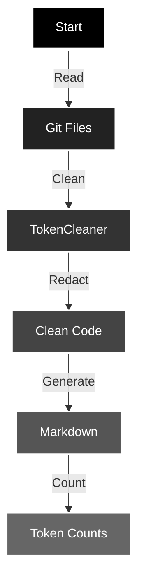

# code-tokenizer-md

> Created to push creative limits.

Process git repository files into markdown with token counting and sensitive data redaction.

## Overview

`code-tokenizer-md` is a TypeScript/Bun tool that processes git repository files, cleans code, redacts sensitive information, and generates markdown documentation with token counts.



## Features

### Data Processing

- Reads files from git repository
- Removes comments and unnecessary whitespace
- Redacts sensitive information (API keys, tokens, etc.)
- Counts tokens using llama3-tokenizer

### Analysis Types

- Token counting per file
- Total token usage
- File content analysis
- Sensitive data detection

### Data Presentation

- Markdown formatted output
- Code block formatting
- Token count summaries
- File organization hierarchy

## Requirements

- Node.js (>=14.0.0)
- Bun runtime
- Git repository

## Installation


## Usage

### CLI

```shell
npx code-tokenizer-md
```

### Library
### 
```shell
npm install code-tokenizer-md
```


### Programmatic Usage

```typescript
import { MarkdownGenerator } from 'code-tokenizer-md';

const generator = new MarkdownGenerator({
  dir: './project',
  outputFilePath: './output.md',
});

const result = await generator.createMarkdownDocument();
```

## Project Structure

```
src/
├── index.ts              # Main exports
├── TokenCleaner.ts       # Code cleaning and redaction
├── MarkdownGenerator.ts  # Markdown generation logic
├── cli.ts               # CLI implementation
├── fileExclusions.ts    # File exclusion patterns
└── fileTypeExclusions.ts # File type exclusions
```

## Dependencies

```json
{
  "dependencies": {
    "llama3-tokenizer-js": "^1.0.0",
    "micromatch": "^4.0.8"
  },
  "peerDependencies": {
    "node": ">=14.0.0"
  },
  "devDependencies": {
    "@eslint/js": "^9.14.0",
    "eslint": "^9.14.0",
    "globals": "^15.12.0",
    "prettier": "^3.3.3",
    "bun": "latest",
    "@types/bun": "latest",
    "@types/node": "^22.9.1",
    "@types/micromatch": "^4.0.9"
  }
}
```

## Development

This project uses [bun](https://github.com/oven-sh/bun) for it's toolchain. You should be able to use whatever you want as a consumer of the library. 

### Building
```shell
npm run build
```

### Testing

```shell
npm test
```

### Linting and Formatting

```shell
# Lint
npm run lint

# Fix linting issues
npm run lint:fix

# Format code
npm run format

# Fix all (format + lint)
npm run fix
```

## Extending

### Adding Custom Patterns

```typescript
const generator = new MarkdownGenerator({
  customPatterns: [{ regex: /TODO:/g, replacement: '' }],
  customSecretPatterns: [{ regex: /mySecret/g, replacement: '[REDACTED]' }],
});
```

### Configuration Options

```typescript
interface MarkdownGeneratorOptions {
  dir?: string;               // Project directory
  outputFilePath?: string;    // Output markdown file path
  fileTypeExclusions?: Set<string>;  // File types to exclude
  fileExclusions?: string[];  // File patterns to exclude
  customPatterns?: Record<string, any>;  // Custom cleaning patterns
  customSecretPatterns?: Record<string, any>;  // Custom redaction patterns
  verbose?: boolean;          // Enable verbose logging
}
```

## Contributing

1. Fork the repository
2. Create a feature branch
3. Commit your changes
4. Push to the branch
5. Open a Pull Request

### Contribution Guidelines

- Write TypeScript code following the project's style
- Include appropriate error handling
- Add documentation for new features
- Include tests for new functionality
- Update the README for significant changes

## License

MIT © 2024 Geoff Seemueller

## Note

This tool requires a git repository to function properly.