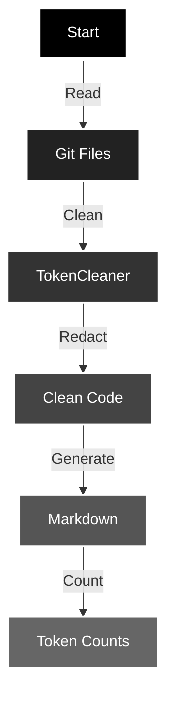

# code-tokenizer-md

> Created to push creative limits.

Process git repository files into markdown with token counting and sensitive data redaction.

## Overview

`code-tokenizer-md` is a Node.js tool that processes git repository files, cleans code, redacts sensitive information, and generates markdown documentation with token counts.



## Features

### Data Processing
- Reads files from git repository
- Removes comments and unnecessary whitespace
- Redacts sensitive information (API keys, tokens, etc.)
- Counts tokens using llama3-tokenizer

### Analysis Types
- Token counting per file
- Total token usage
- File content analysis
- Sensitive data detection

### Data Presentation
- Markdown formatted output
- Code block formatting
- Token count summaries
- File organization hierarchy

## Requirements

- Node.js (>=14.0.0)
- Git repository
- npm or npx

## Installation

```shell
npm install -g code-tokenizer-md
```

## Usage

### Quick Start

```shell
npx code-tokenizer-md
```

### Programmatic Usage

```javascript
import { MarkdownGenerator } from 'code-tokenizer-md';

const generator = new MarkdownGenerator({
  dir: './project',
  outputFilePath: './output.md'
});

const result = await generator.createMarkdownDocument();
```

## Project Structure

```
src/
├── index.js              # Main exports
├── TokenCleaner.js       # Code cleaning and redaction
├── MarkdownGenerator.js  # Markdown generation logic
└── cli.js               # CLI implementation
```

## Dependencies

```json
{
  "dependencies": {
    "llama3-tokenizer-js": "^1.0.0"
  },
  "peerDependencies": {
    "node": ">=14.0.0"
  }
}
```

## Extending

### Adding Custom Patterns

```javascript
const generator = new MarkdownGenerator({
  customPatterns: [
    { regex: /TODO:/g, replacement: '' }
  ],
  customSecretPatterns: [
    { regex: /mySecret/g, replacement: '[REDACTED]' }
  ]
});
```

## Contributing

1. Fork the repository
2. Create a feature branch
3. Commit your changes
4. Push to the branch
5. Open a Pull Request

### Contribution Guidelines

- Follow Node.js best practices
- Include appropriate error handling
- Add documentation for new features
- Include tests for new functionality (this project needs a suite)
- Update the README for significant changes

## License
MIT © 2024 Geoff Seemueller

## Note

This tool requires a git repository to function properly.
