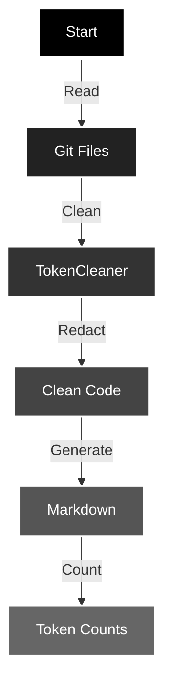

# code-tokenizer-md

> Created to push creative limits. Processes git repository files into markdown with token counting and sensitive data redaction. 

## Quickstart
```
$ cd your-git-repo
$ npx code-tokenizer-md
```
#### Next Steps: Refine your outputs with [.code-tokenizer-md-ignore](#ignore-file-configuration) 

## Overview

`code-tokenizer-md` is a tool that processes git repository files, cleans code, redacts sensitive information, and generates markdown documentation with token counts.



## Features

### Data Processing

- Reads files from git repository
- Removes comments and unnecessary whitespace
- Redacts sensitive information (API keys, tokens, etc.)
- Counts tokens using llama3-tokenizer

### Analysis Types

- Token counting per file
- Total token usage
- File content analysis
- Sensitive data detection

### Data Presentation

- Markdown formatted output
- Code block formatting
- Token count summaries
- File organization hierarchy

## Requirements

- Node.js (>=14.0.0)
- Bun runtime
- Git repository

## Installation

```shell
npm install code-tokenizer-md
```

## Usage

### CLI

```shell
npx code-tokenizer-md
```

### Programmatic Usage

```typescript
import { MarkdownGenerator } from 'code-tokenizer-md';

const generator = new MarkdownGenerator({
  dir: './project',
  outputFilePath: './output.md',
});

const result = await generator.createMarkdownDocument();
```

`## Ignore File Configuration`

### .code-tokenizer-md-ignore

The `.code-tokenizer-md-ignore` file allows you to specify patterns for files and directories that should be excluded from processing. You can create this file in any directory within your project, and it will affect that directory and all subdirectories.

#### Features:

- Supports nested ignore files (multiple .code-tokenizer-md-ignore files in different directories)
- Uses glob patterns for matching
- Inherits patterns from parent directories
- Supports both relative and absolute paths

Example `.code-tokenizer-md-ignore` file:
```
# Ignore specific files
secrets.json
config.private.ts

# Ignore directories
build/
temp/

# Glob patterns
**/*.test.ts
**/._*
```

#### Pattern Rules:
- Lines starting with `#` are comments
- Empty lines are ignored
- Patterns are relative to the ignore file's location
- Use `**` for matching across directories
- Patterns without leading `/` or `**` are relative to the ignore file's directory
- Patterns with leading `/` are relative to the project root

## Bundling Process

The project uses Bun's built-in bundler for creating optimized production builds. The bundling process includes:

1. **Source Compilation**:
    - TypeScript files are compiled using Bun's native TypeScript support
    - Declaration files are generated using `bun-plugin-isolated-decl`
    - Output is optimized for Node.js runtime

2. **CLI Bundling**:
    - Separate bundle for CLI usage
    - Compiled to native binary for improved performance
    - Includes shebang for direct execution

3. **Output Structure**:
   ```
   dist/
   ├── index.js      # Main library bundle
   ├── index.d.ts    # TypeScript declarations
   └── code-tokenizer-md  # CLI executable
   ```

4. **Bundle Configuration**:
    - Target: Node.js
    - Module Format: ESM
    - Includes source maps
    - Preserves path resolution

## Project Structure

```
src/
├── index.ts              # Main exports
├── TokenCleaner.ts       # Code cleaning and redaction
├── MarkdownGenerator.ts  # Markdown generation logic
├── cli.ts               # CLI implementation
├── fileExclusions.ts    # File exclusion patterns
└── fileTypeExclusions.ts # File type exclusions
```

## Dependencies

```json
{
  "dependencies": {
    "llama3-tokenizer-js": "^1.0.0",
    "micromatch": "^4.0.8"
  },
  "peerDependencies": {
    "node": ">=14.0.0"
  },
  "devDependencies": {
    "@eslint/js": "^9.14.0",
    "eslint": "^9.14.0",
    "globals": "^15.12.0",
    "prettier": "^3.3.3",
    "bun": "latest",
    "@types/bun": "latest",
    "@types/node": "^22.9.1",
    "@types/micromatch": "^4.0.9"
  }
}
```

## Development

This project uses [bun](https://github.com/oven-sh/bun) for its toolchain. You should be able to use whatever you want as a consumer of the library.

### Building
```shell
npm run build
```

### Testing

```shell
npm test
```

### Linting and Formatting

```shell
# Lint
npm run lint

# Fix linting issues
npm run lint:fix

# Format code
npm run format

# Fix all (format + lint)
npm run fix
```

## Extending

### Adding Custom Patterns

```typescript
const generator = new MarkdownGenerator({
  customPatterns: [{ regex: /TODO:/g, replacement: '' }],
  customSecretPatterns: [{ regex: /mySecret/g, replacement: '[REDACTED]' }],
});
```

### Configuration Options

```typescript
interface MarkdownGeneratorOptions {
  dir?: string;               // Project directory
  outputFilePath?: string;    // Output markdown file path
  fileTypeExclusions?: Set<string>;  // File types to exclude
  fileExclusions?: string[];  // File patterns to exclude
  customPatterns?: Record<string, any>;  // Custom cleaning patterns
  customSecretPatterns?: Record<string, any>;  // Custom redaction patterns
  verbose?: boolean;          // Enable verbose logging
}
```

## Contributing

1. Fork the repository
2. Create a feature branch
3. Commit your changes
4. Push to the branch
5. Open a Pull Request

### Contribution Guidelines

- Write TypeScript code following the project's style
- Include appropriate error handling
- Add documentation for new features
- Include tests for new functionality
- Update the README for significant changes

## License

MIT © 2024 Geoff Seemueller

## Note

This tool requires a git repository to function properly.